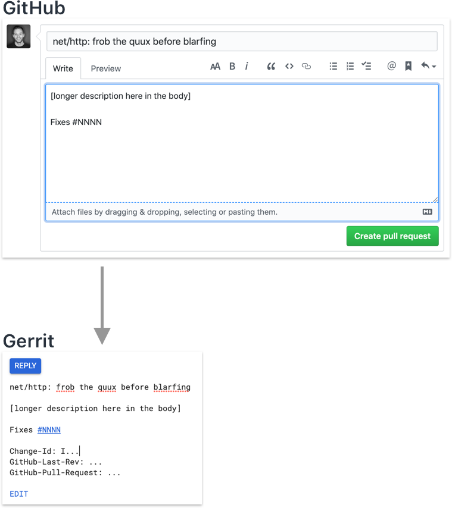

# Commit messages

Commit messages, also known as CL (changelist) descriptions, should be formatted per https://tip.golang.org/doc/contribute.html#commit_messages . For example,

```
net/http: frob the quux before blarfing

[longer description here in the body]

Fixes #nnnn
```

Notably, for the subject (the first line of description):

* the name of the package affected by the change goes before the colon
* the part after the colon uses the verb tense + phrase that completes the blank in, *"This change modifies Go to ___________"*
* the verb after the colon is lowercase
* there is no trailing period
* it should be kept as short as possible (many git viewing tools prefer under ~76 characters, though Go isn't super strict about this).

For the body (the rest of the description):

* the text should be wrapped to ~76 characters (to appease git viewing tools, mainly), unless you really need longer lines (e.g. for ASCII art, tables, or long links)
* the Fixes line goes after the body with a blank newline separating the two
* there is **no** Markdown in the commit message
* we **do not** use `Signed-off-by` lines. Don't add them. Our Gerrit server & GitHub bots enforce CLA compliance instead.
* when referencing CLs, prefer saying "CL nnn" or using a golang.org/cl/nnn shortlink over a direct Gerrit URL, since that's more future-proof.
* when moving code between repos, include the CL, repository name, and git hash that it was moved from/to, so it is easier to trace history/blame.

Please _don't_ use alternate GitHub-supported aliases like `Close` or `Resolves` instead of `Fixes`.

To link a commit to an issue without marking it fixed—for example, if the commit is working toward a fix but not yet a complete fix—GitHub requires only that the issue is mentioned by number in the commit message. By convention, Go commits mention this at the bottom of the message using `For`, where `Fixes` might be expected, even if the number is also mentioned in the body of the commit message.

For example:

```
Refactor func Foo.
This will make the handling of <corner case>
shorter and easier to test.

For #nnnn.
```

It is common in other Git projects to use `Updates` instead of `For`, and that is acceptable too, even though it makes little sense. More precise phrasings are fine too. (Don't ask people to change from `Updates` or something else to `For`, or vice versa.)

# Other repos

For non-"go" repos ("crypto", "tools", "net", etc), the subject is still the name of the package, but you need to fully-qualify the issue number with the GitHub org/repo syntax:

```
cipher/rot13: add new super secure cipher

Fixes golang/go#1234
````

Notably, the first line subject should **not** contain the `x/crypto/` prefix. We only do that for the issue tracker.

# Non-normative references

- [Please heed my plea and write good CL descriptions for Go—and for any other project you work on.](https://groups.google.com/d/msg/golang-dev/6M4dmZWpFaI/SyU5Sl4zZLYJ)
- [The CL description is a public document that explains to the future what has been done and why.](https://groups.google.com/d/msg/golang-dev/s07ZUR8ZDHo/i-rIsknbAwAJ)

# GitHub Pull Requests

If you're using GitHub Pull Requests, your commit message is constructed by GerritBot based on your
PR's title & description. See https://github.com/golang/go/wiki/GerritBot#how-does-gerritbot-determine-the-final-commit-message

If somebody asks you to modify your commit message, you'll need to modify your PR.

